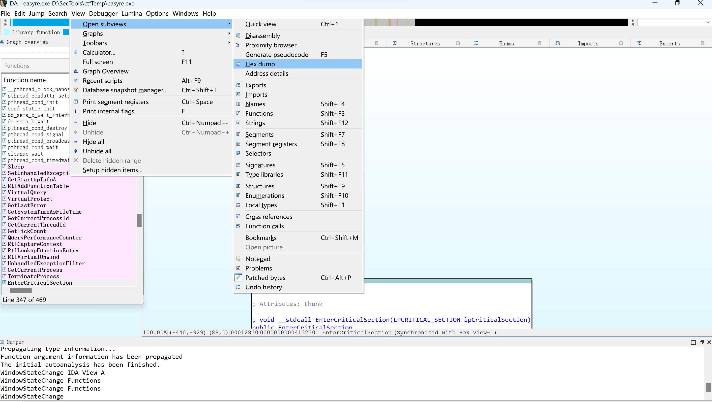
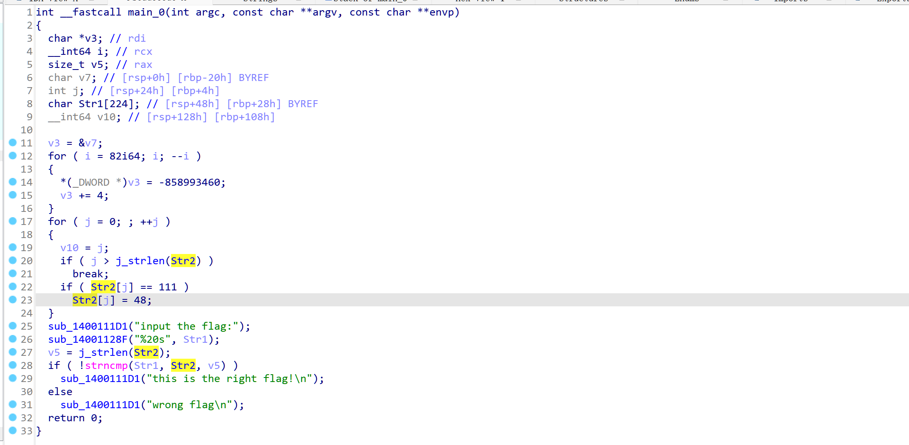
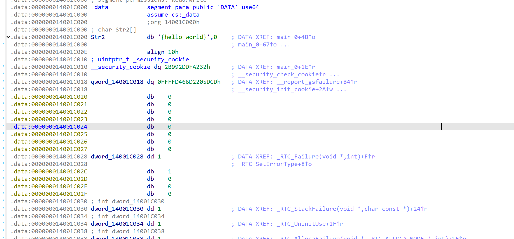

IDA Pro是一款逆向工程工具，可以用来分析二进制文件，它可以将二进制文件转换成汇编代码，方便我们进行逆向分析。IDA Pro是一款非常强大的逆向工程工具，但是它的学习曲线也比较陡峭，所以我们需要一些基础的知识来帮助我们学习IDA Pro。
===

IDA 分为IDA 32 ,IDA 64,IDA 64是64位的，IDA 32是32位的，我们一般使用IDA 64来分析64位的二进制文件，使用IDA 32来分析32位的二进制文件。

IDA Pro的界面分为几个部分，分别是：
1. 菜单栏
2. 工具栏
3. 函数列表
4. 反汇编窗口
5. 数据窗口
6. 交叉引用窗口
7. 寄存器窗口
8. 栈窗口
9. 伪代码窗口
10. 导入导出窗口

### 先看IDA View界面

## 如何通过反汇编转成C语言代码

我们可以通过IDA Pro将反汇编代码转换成C语言代码，这样我们就可以更加方便的进行逆向分析。我们可以通过以下步骤来将反汇编代码转换成C语言代码：
1. 打开二进制文件
2. 反汇编二进制文件
3. 选择要转换的函数

**跳转变量**

