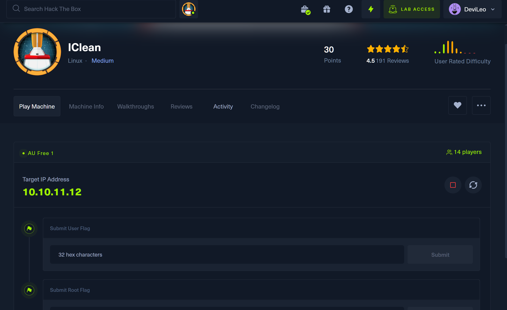
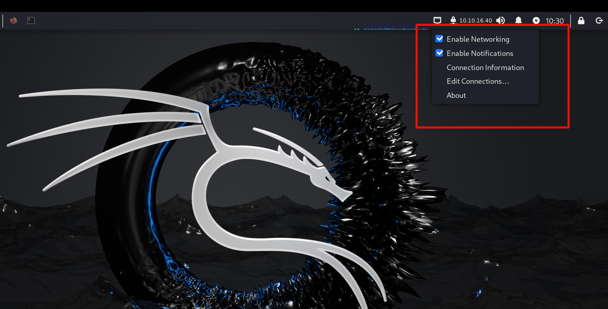
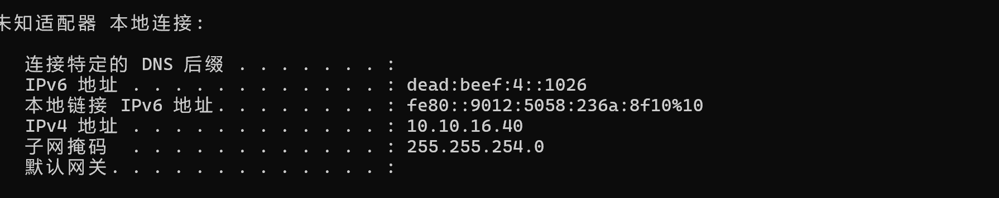
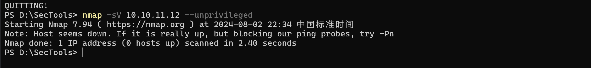
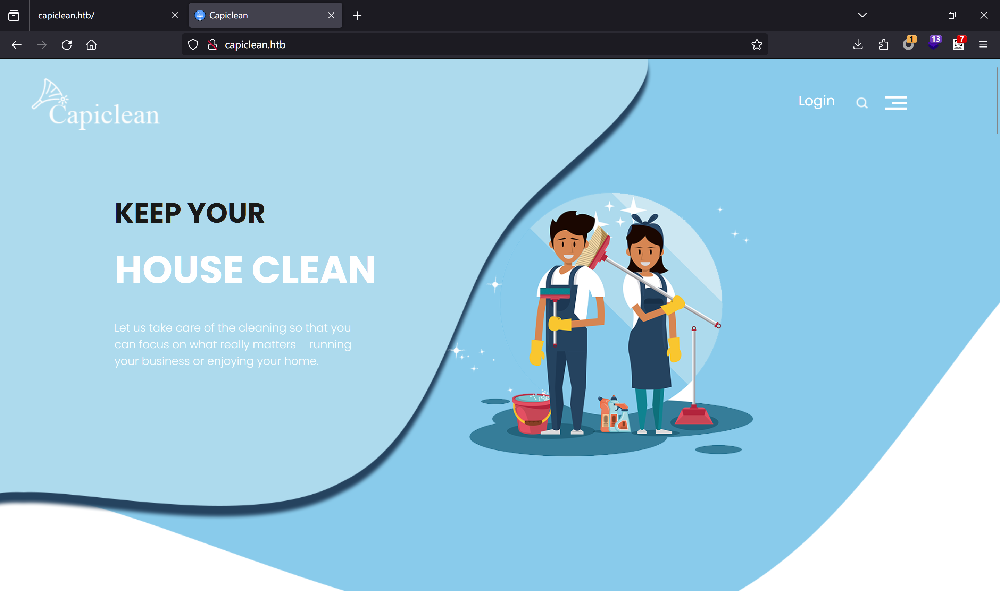
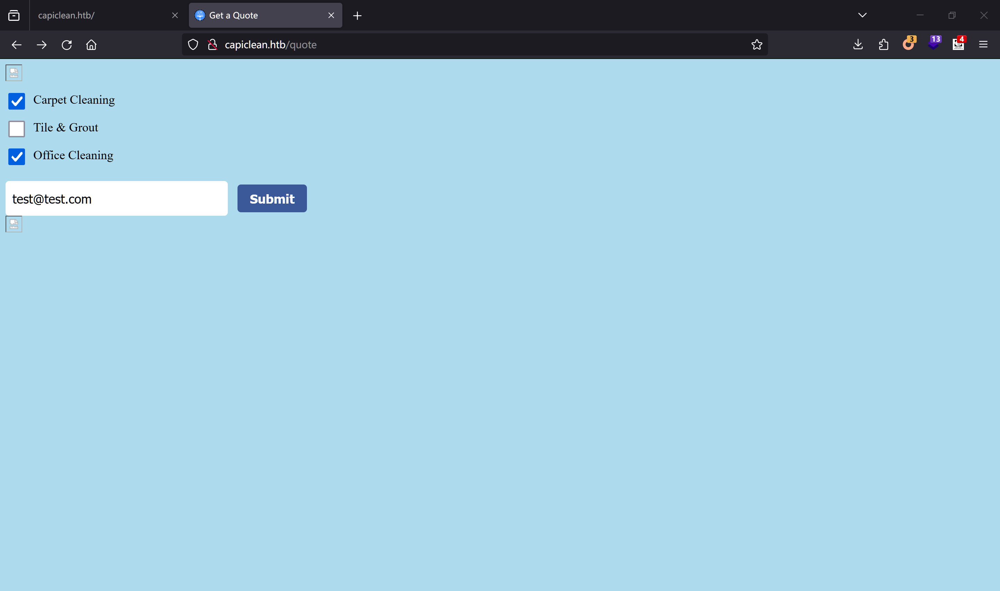
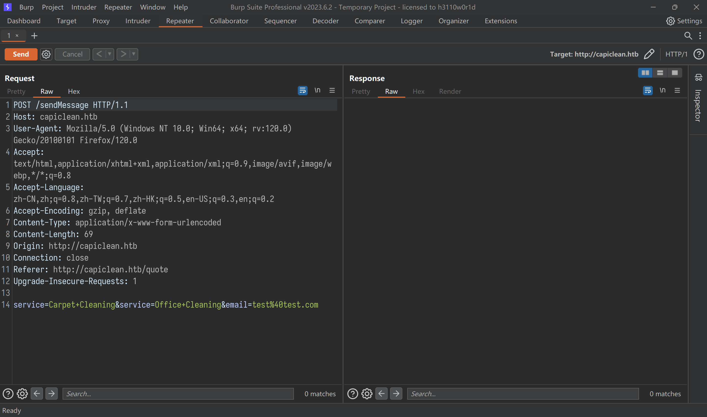

IClean 获取flag
===

## 机器环境
### 目标机器 

IP : 10.10.11.12




> 由于我想要使用windows中的浏览器和burpusuite进行攻击, 但是同时想要使用kali中的工具进行攻击，如何实现呢？
> 

### 宿主机器

IP : 




## 渗透思路

1. 给的是IP地址，直接扫描端口
    
    被扫坏了 重新启动

2. 看到80端口，直接访问
    
    登录API
    http://capiclean.htb/login
    http://capiclean.htb/quote

    
    

### XSS
 
  web界面
  


    ```bash
  
    ```

### cao, 遮掉网络不稳啊

玩玩ctf吧， 好像白天稳啊