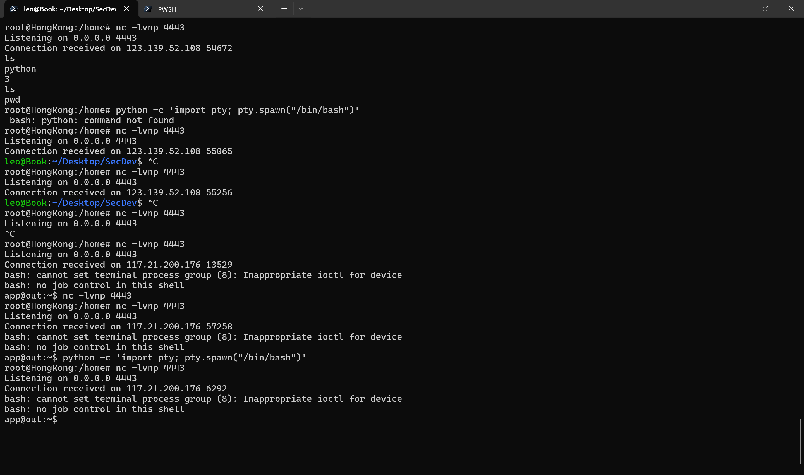
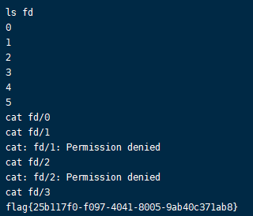

[V&N2020 公开赛]CHECKIN
====


# 直接代码审计

```python
from flask import Flask, request
import os

app = Flask(__name__)

flag_file = open("flag.txt", "r")
# flag = flag_file.read()
# flag_file.close()

# @app.route('/flag')
# def flag():
#     return flag
#     ## want flag? naive!
#     # You will never find the thing you want:)

@app.route('/shell')
def shell():
    os.system("rm -f flag.txt")
    exec_cmd = request.args.get('c')
    os.system(exec_cmd)
    return "1"

@app.route('/')
def source():
    return open("app.py", "r").read()

if __name__ == "__main__":
    app.run(host='0.0.0.0')
```

## walk through

1. 任意代码执行？
2. 但是flag.txt被删除了
3. 我拿到shell 是不是能hui复原flag.txt呢？

## 由于buuoj不能读取外网

拿到一个linux lab




获取到不到交互式shell

