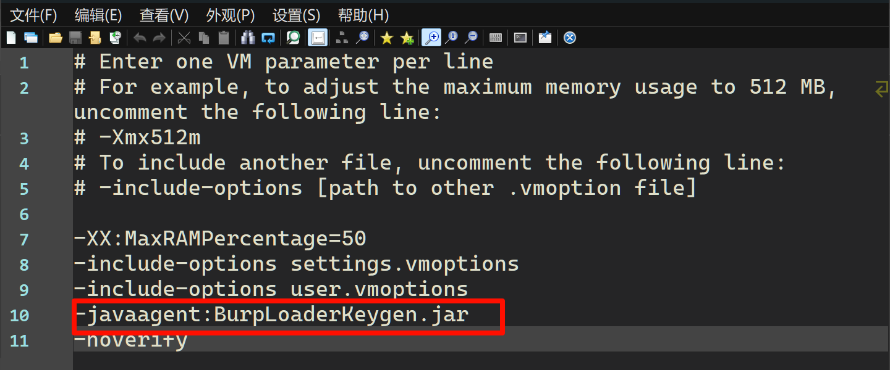
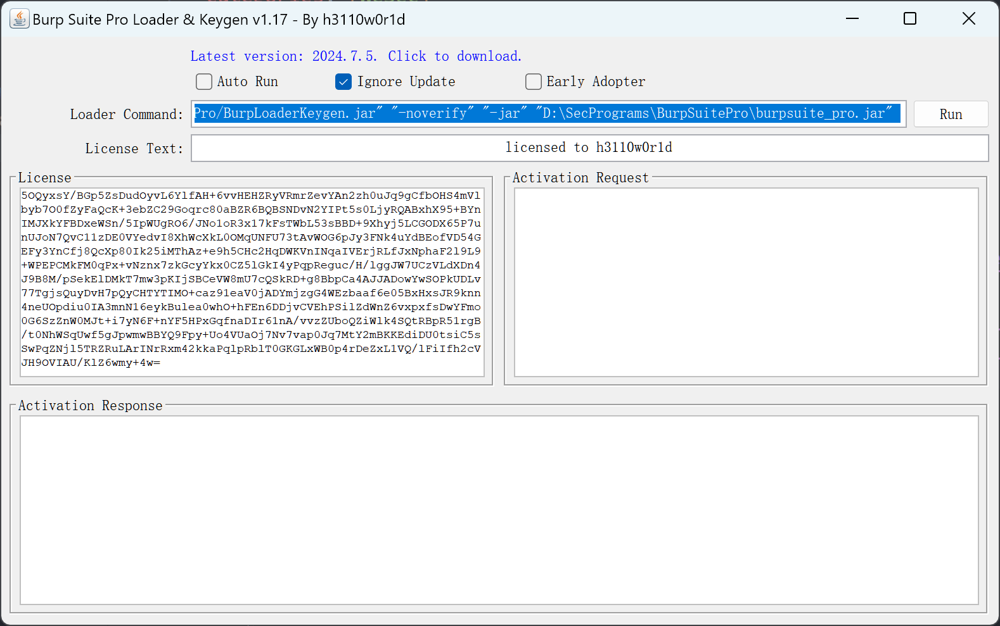

## 安装

1. 推荐下载最新版本的 BurpSuite，[官方下载地址](https://portswigger.net/burp/releases#professional)
2. 最新的里面自己携带了JDK, 避免JDK版本不匹配的问题
3. 注册机 ,可以去[text](https://imli.ink/site/)**ByteSec**获取
4. 修改BurpSuitePro.vmoptions文件内容 注意注册机器名称一致
5. 启动

## 界面

1. 看板
2. 目标
3. 代理
4. 重放
5. 外带
6. 随机检测
7. 编码
8. 对比
9. 日志
10. 扩展

## 看板 Dashboard

1. 扫描和实时任务