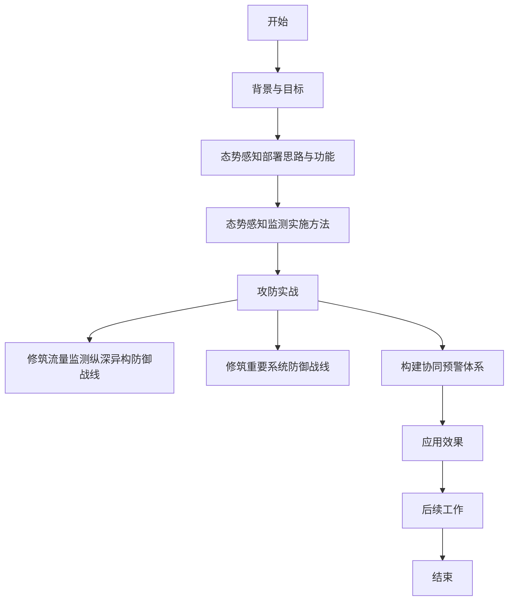
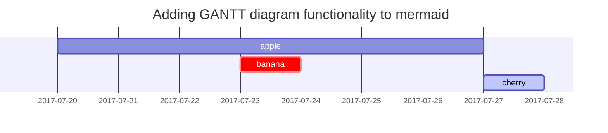

# 态势感知安全检测

该文档中提到的具体措施包括：
1. **修筑流量监测纵深异构防御战线**：
    - 了解各流量监测安全产品优缺点，摸排现有流量镜像网中各流量镜像节点的流量情况。
    - 统筹规划不同流量监测系统流量探针的流量分配方案，通过重做map、去重、过滤等手段解决“安全设备丢包、流量镜像网带宽占满”的问题。
    - 收敛对外暴露或跨域暴露的高危端口、弱密码、管理后台等，清理内网失陷机器及违规行为。
2. **修筑重要系统防御战线**：
    - 收集网络日志、安全日志、应用日志、资产信息、威胁情报等5大类数据，包括多种具体日志。
    - 编排数据源监控面板，依据历史基线定义每类数据源的收取频率，对未按时收到的日志进行标红显示并短信告警。
    - 将重要系统（如堡垒机系统、域控服务器、VPN、数据交换系统等）、重要账号加入重点监控范畴。
    - 在条件允许的情况下，对重要系统进行攻击测试，保证对其进行攻击或者变更能触发相关告警。
3. **构建协同预警体系**：
    - 整合实景化攻防技战术的深入研究成果以及强对抗环境下防御手段的创新应用，以智能化的方式实现海量攻击日志数据的自动关联分析，实时监测HW高危事件。
    - 通过API对接威胁情报管理平台，对访问【客户名称】资产的全量互联网IP进行威胁情报匹配，根据匹配结果进行相应处理（加入重点关注清单或立即封禁）。
    - 通过对接蜜罐系统，对攻击者的攻击行为进行捕获，获取攻击者相关信息，提升预警的精准度。
    - 对攻击模型不断迭代，减少误报率和漏报率，实时扩展攻击模型。
    - 提升安全态势感知平台中的数据质量，精准匹配数据模型。
4. **后续工作**：
    - 增加探针部署与各个网络节点，并与二级单位态势感知平台互联互通，建设中国【客户名称】网络安全态势感知一张图。
    - 全面利用安全态势感知平台将SIP、情报、沙箱等多维安全产品集中管控，重点做好防守对抗自动化和安全态势可视化。
        - 防守对抗自动化：通过安全态势感知平台构建演习相关攻击分析场景，快速发现安全事件根源，确定攻击手段及评估攻击损失，实时、精准生成待封禁IP清单；结合安全技术自动化编排与响应，将封禁/解封IP清单下发至两地三中心以及子公司的互联网墙进行实时封禁。
        - 安全态势可视化：在安全态势感知平台设置多维度的安全风险指标，构建安全运营、安全运维为一体的安全态势总览；借助可视化程度高且细粒度、高精度的风险监测模型，及时发现和处置网络中的可疑事件；通过动态描绘攻击及防守趋势图，实现安全风险及态势的全景可视化管控。

