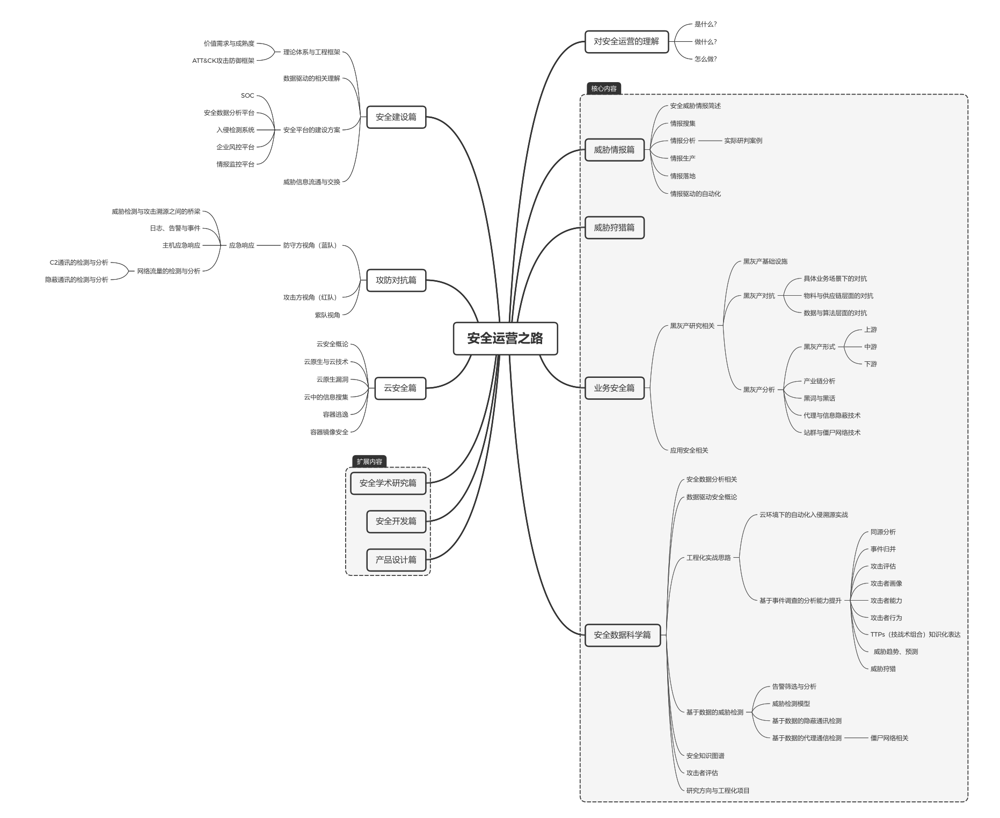

# 安全运营思维导图

以下是对文档《安全运营之路》的总结：
1. **对安全运营的理解**：
    - **是什么**：未明确提及。
    - **做什么**：包括满足价值需求和提升成熟度，涉及理论体系与工程框架，以及ATT&CK攻击防御框架。
    - **怎么做**：通过数据驱动，涵盖核心内容如SOC、安全威胁情报简述、安全数据分析平台等。
2. **安全建设篇**：
    - **情报搜集**：包括入侵检测系统等。
    - **安全平台的建设方案**：未明确提及。
    - **情报分析实际研判案例**：未明确提及。
    - **企业风控平台**：未明确提及。
3. **威胁情报篇**：
    - **情报生产**：未明确提及。
    - **情报监控平台**：未明确提及。
    - **情报落地**：包括威胁信息流通与交换、情报驱动的自动化等。
    - **威胁检测与攻击溯源之间的桥梁**：未明确提及。
4. **威胁狩猎篇**：
    - **日志、告警与事件**：未明确提及。
    - **主机应急响应**：包括应急响应防守方视角（蓝队）。
    - **C2通讯的检测与分析**：未明确提及。
    - **黑灰产基础设施**：未明确提及。
    - **网络流量的检测与分析**：未明确提及。
    - **隐蔽通讯的检测与分析**：未明确提及。
    - **具体业务场景下的对抗**：未明确提及。
5. **攻防对抗篇**：
    - **物料与供应链层面的对抗**：未明确提及。
    - **黑灰产对抗**：包括攻击方视角（红队）、数据与算法层面的对抗、紫队视角等。
    - **黑灰产研究相关**：未明确提及。
6. **上游**：
    - **安全运营之路**：未明确提及。
    - **云安全概论**：未明确提及。
7. **中游**：
    - **黑灰产形式**：未明确提及。
    - **云原生与云技术**：未明确提及。
8. **下游**：
    - **云原生漏洞**：未明确提及。
    - **产业链分析**：未明确提及。
9. **业务安全篇**：
    - **云安全篇**：未明确提及。
    - **黑灰产分析**：包括黑词与黑话。
    - **云中的信息搜集**：包括代理与信息隐蔽技术。
    - **容器逃逸**：未明确提及。
    - **站群与僵尸网络技术**：未明确提及。
    - **容器镜像安全**：未明确提及。
    - **应用安全相关**：未明确提及。
10. **扩展内容**：
    - **安全数据分析相关**：未明确提及。
    - **安全学术研究篇**：包括数据驱动安全概论、云环境下的自动化入侵溯源实战。
    - **安全开发篇**：包括同源分析、事件归并、工程化实战思路。
    - **产品设计篇**：包括攻击评估、攻击者画像、基于事件调查的分析能力提升。
    - **攻击者能力**：未明确提及。
    - **攻击者行为**：未明确提及。
    - **安全数据科学篇**：包括TTPs（技战术组合）知识化表达、威胁趋势、预测、威胁狩猎、告警筛选与分析、威胁检测模型、基于数据的威胁检测、基于数据的隐蔽通讯检测、基于数据的代理通信检测（僵尸网络相关）、安全知识图谱、攻击者评估。
    - **研究方向与工程化项目**：未明确提及。

安全运营的理论体系可能涉及以下方面：
1. **价值需求与成熟度**：满足企业或组织的安全需求，提升安全运营的成熟度，以应对各种安全威胁。
2. **ATT&CK攻击防御框架**：可能作为安全运营中的一种参考框架，用于指导攻击防御策略的制定和实施。
3. **数据驱动**：以数据为核心，通过对安全数据的分析和处理，实现对安全威胁的检测、预警和响应。
4. **SOC（安全运营中心）**：作为安全运营的核心组件，负责整合和管理安全信息，协调安全响应工作。
5. **安全威胁情报**：包括情报的搜集、生产、监控、落地等环节，为安全运营提供情报支持。

需要注意的是，以上仅为根据文档内容进行的推测，具体的安全运营理论体系还需要参考更多相关资料和实践经验。

总体而言，文档对安全运营的各个方面进行了概述，但具体内容在总结中大多未明确提及，需要进一步查看文档详细了解。