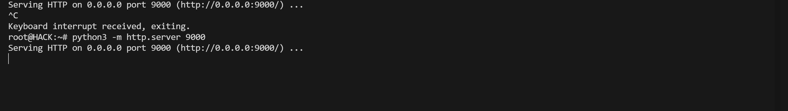
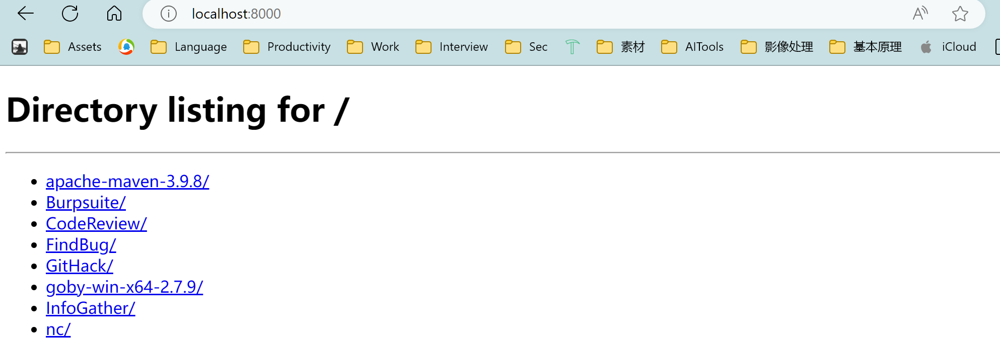
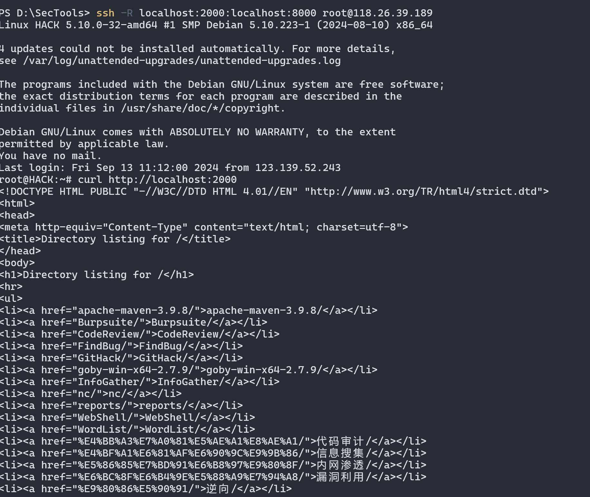
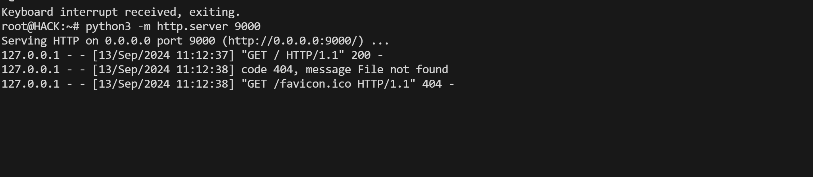
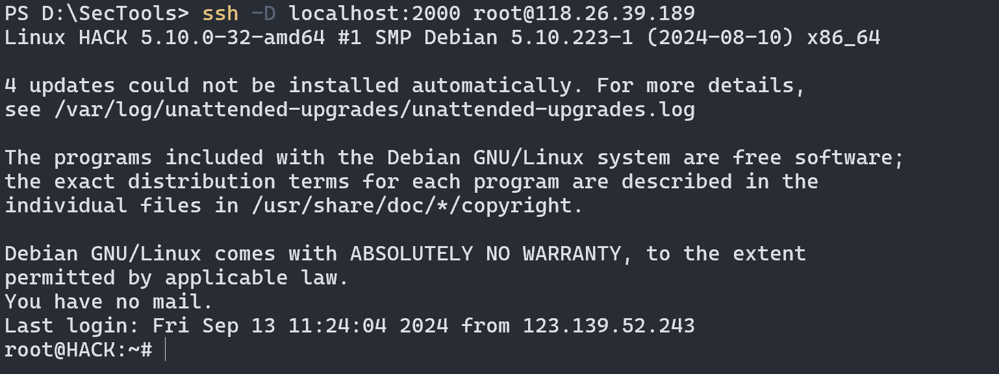

# SSH 有三种端口转发
**本地端口转发(Local Port Forwarding)**，
:logbook:
  CLOCK: [2024-09-13 Fri 11:06:21]--[2024-09-13 Fri 11:06:22] =>  00:00:01
  CLOCK: [2024-09-13 Fri 11:06:23]--[2024-09-13 Fri 11:06:28] =>  00:00:05
:END:
远程端口转发(Local Port Forwarding)
动态端口转发(Dynamic Port Forwarding)
# 本地端口转发
vps启动一个9000的服务，但是防火墙是关闭的，现在不需要开启防火墙如何进行访问呢，（22端口开启了）
# SSH 有三种端口转发
**本地端口转发(Local Port Forwarding)**，
:logbook:
  CLOCK: [2024-09-13 Fri 11:06:21]--[2024-09-13 Fri 11:06:22] =>  00:00:01
  CLOCK: [2024-09-13 Fri 11:06:23]--[2024-09-13 Fri 11:06:28] =>  00:00:05
:END:
远程端口转发(Local Port Forwarding)
动态端口转发(Dynamic Port Forwarding)
# 本地端口转发
vps启动一个9000的服务，但是防火墙是关闭的，现在不需要开启防火墙如何进行访问呢，（22端口开启了）

本机执行
```bash
  ssh -L 2000:localhost:9000 root@118.26.39.189
```

## 远程端口转发
本地机器启动一个8000的服务 ，vps需要访问这个服务，如何实现，本地机器没有公网IP

```bash
  ssh -R localhost:2000:localhost:8000 root@118.26.39.189
  ssh -R 2000:localhost:8000 root@118.26.39.189
  ssh -R 2000:192.168.0.100:8000 root@118.26.39.189
  同理
  
```

## 动态端口转发
*远程云主机B1运行了多个服务，分别使用了不同端口，本地主机A1需要访问这些服务。*
```
  ssh -D localhost:2000 root@118.26.39.189
```
还是开设9000


