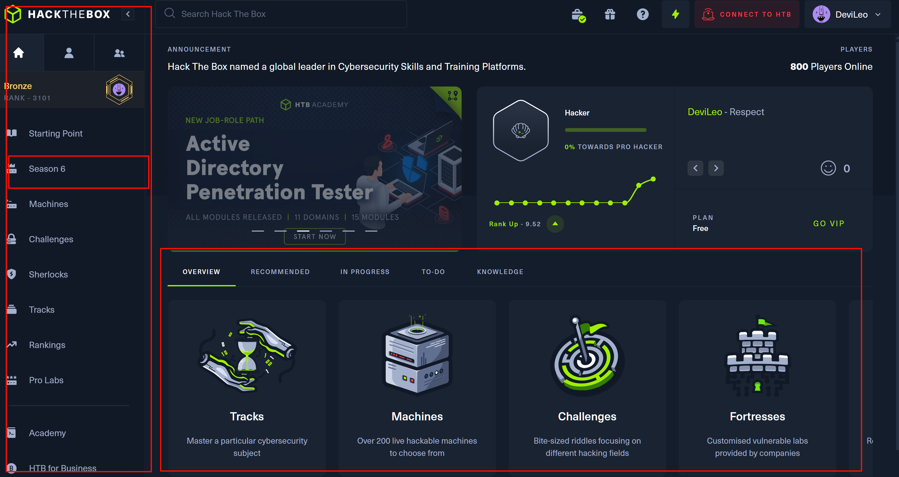

## 靶场平台

这里重要练习的靶场有:

| 靶场 | 推荐指数 | 评价 |
| --- | --- | --- |
| Hack The Box | ⭐⭐⭐⭐⭐ | 内容难度中, 完整的攻击流程 从webshell到rootshell，有赛季靶场基本一周一个，互联网上基本没有wp, 全靠自己, 容易放弃 |
| VulnHub | ⭐⭐⭐⭐ | OFFSEC维护，现在没啥新出的靶场了，但是历史靶场有好多思路可以参考 |
| TryHackMe | ⭐⭐⭐⭐ | 这里我只是使用的在线攻击机和靶场，openvpn在我这里网络有问题还没解决，知道的可以留言，请教一下，顺便说一下它家的知识文档挺好的，可以当作知识库|
| OverTheWire | ⭐⭐| 适合初学者, 有很多靶场, 有很多靶场有详细的攻击流程 |
| RootMe | ⭐⭐ | 有很多靶场, 有很多靶场有详细的攻击流程, 类似CTF平台不太推荐 |
| 春秋云镜| ⭐⭐⭐ | 国内平台，还不错，免费的漏洞环境，可以复现，复杂的靶场需要收费 |

攻击流程都是大致都是一样的，看的就是细心和基础。以HACKTHEBOX为列，如何入门.

## Hack The Box
 

1. Season 6 就是第6赛季，每个月都要免费的机器可以pwn
2. machines 各种靶场，有难易都有，有的靶场有详细的攻击流程，有的没有
3. Prolab 在真实的企业环境中进行交互式黑客培训。
4. challenges 偏向CTF, 脑洞比较大，不太推荐
5. sherlocks 应急响应和安全溯源

## Q&A 

1. 网络问题，可以使用代理计算器，把openvpn的流量转发到代理服务器，加速扫描

## 攻击流程

1. 信息搜集
2. 漏洞利用
3. 权限提升
4. 痕迹清理